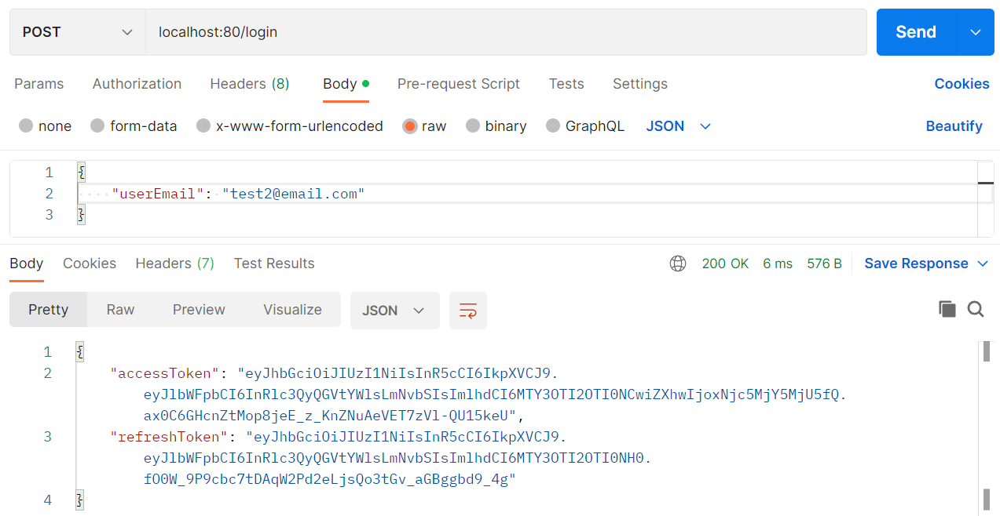
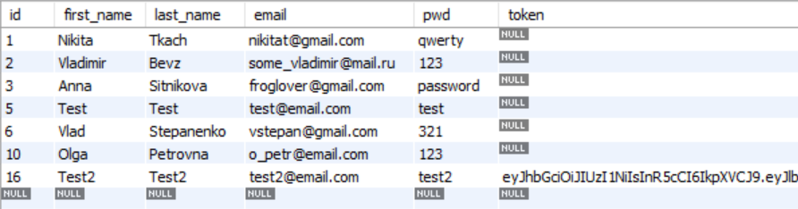
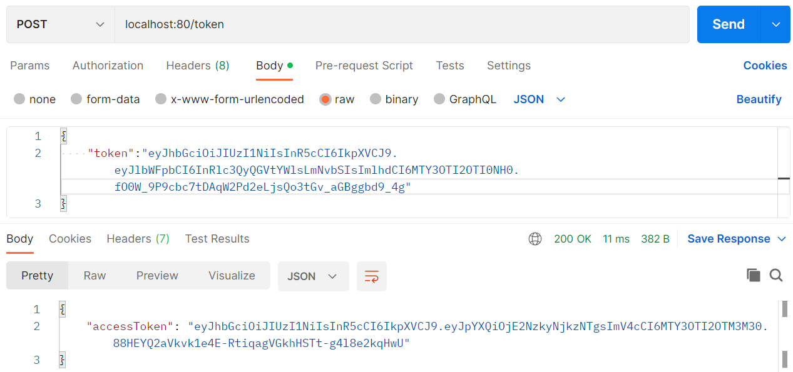
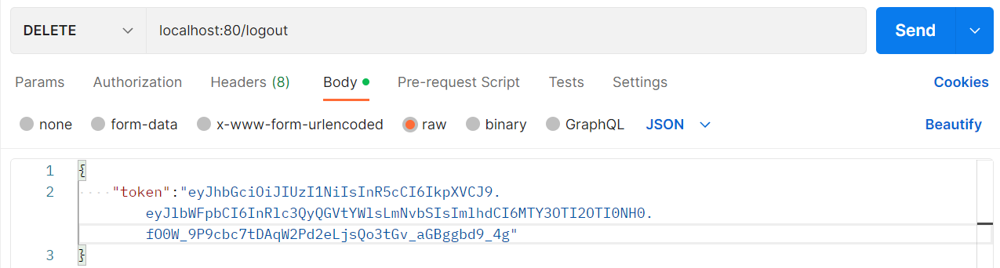
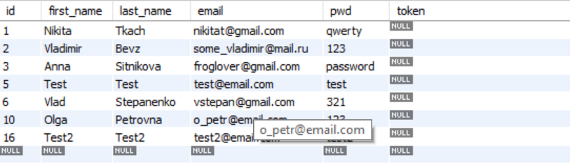
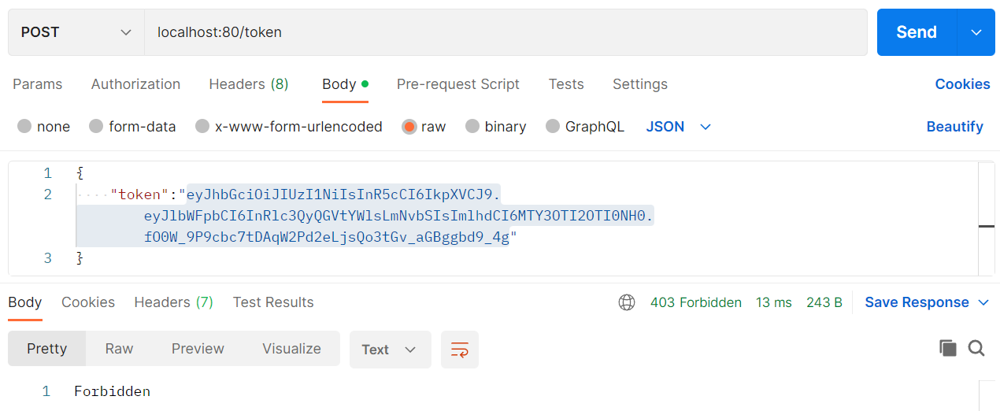

<h2>Testing Auth API using Postman:</h2>

<ol>
  <h4><li>Login request</li></h4>
  New access and refresh tokens for specified user are created, refresh token stored in user table
   
  
   
  MySQL Database:
   
  
  
  
  <h4><li>Token request</li></h4>
  New access token created using refresh token
   
  
  
  <h4><li>Logout request</li></h4>
  Refresh token will be deleted, so it wont be used to update access token
  
   
  The token is also deleted from DB:
   
  
   
  Creating new access tokens using deleted refresh token is forbidden:
   
  
   
  
</ol>
